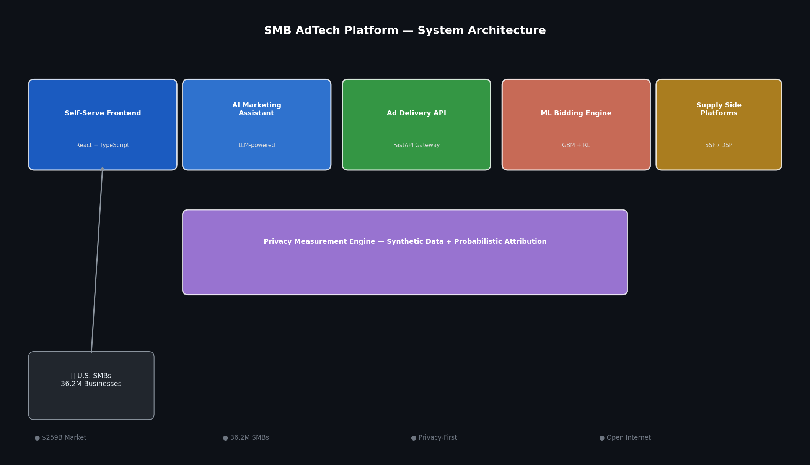
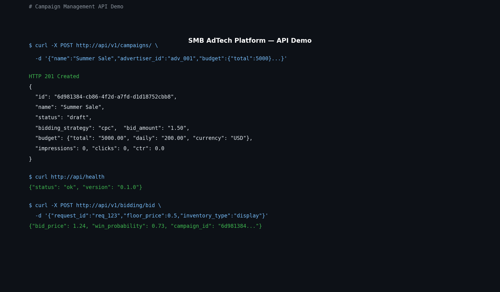

# SMB AdTech Platform

> AI-powered, privacy-compliant digital advertising infrastructure for U.S. small and medium-sized businesses.



## Overview

The SMB AdTech Platform democratizes access to enterprise-grade programmatic advertising for the 36.2 million small and medium-sized businesses (SMBs) in the United States. Most SMBs are locked into a handful of "walled garden" platforms (Meta, Google, TikTok) with no access to the broader open internet and in-app inventory ecosystem.

## The Problem: Why This Matters

### Current SMB Pain Points

1. **Trapped in Walled Gardens** — U.S. SMBs rely heavily on Meta, Google, and TikTok, limiting access to premium inventory (Snapchat, Discord, mobile gaming, CTV).

2. **Technical Barriers** — Enterprise DSPs (The Trade Desk, Adobe DSP) require $50K+ minimum spend and dedicated engineering teams. SMBs cannot afford this.

3. **Privacy Regulations** — Apple's App Tracking Transparency (ATT) means only ~30% of users opt into tracking. Without user-level data, traditional measurement and optimization breaks down for SMBs.

4. **Fragmented Workflow** — Managing multiple platform logins, budgets, and reporting is time-consuming for small teams.

### How the SMB AdTech Platform Solves This

Our platform provides a **self-serve, AI-powered advertising infrastructure** specifically designed for SMBs:

| Capability | Problem Solved |
|-----------|---------------|
| **Cross-Publisher Delivery** | SMBs can access Snapchat, Discord, mobile apps, and the open internet — not just Meta/Google |
| **Privacy-First Attribution** | Probabilistic models work without user IDs, compliant with ATT and emerging U.S. state privacy laws |
| **LLM Marketing Assistant** | Non-technical users create and optimize campaigns via natural language — no DSP expertise required |
| **Automated ML Bidding** | DeepFM + Graph Attention Networks + PPO reinforcement learning optimize bids in real-time, maximizing ROI |

### Real-World Use Case

**Example**: A bakery in Texas wants to run a Mother's Day promotion.

- **Traditional Approach**: Create a Facebook/Instagram ad manually, limited reach, high cost-per-acquisition.
- **With Our Platform**: User types "I want to promote my bakery for Mother's Day" → LLM generates ad copy → System automatically bids across 100+ apps and websites → Real-time ROI dashboard shows performance.

## How Automated Bidding Works (Real-Time Bidding)

Our ML-powered bidding engine makes decisions in **under 50 milliseconds**:

```
1. Ad Exchange sends bid request (OpenRTB format)
   ↓
2. API receives: device type, geo, ad slot, floor price
   ↓
3. ML Inference Pipeline:
   ├── DeepFM → predicts Click-Through Rate (pCTR)
   ├── GAT → calculates ad-content relevance score
   ├── PPO Agent → computes bid adjustment factor δ
   └── GBM → win probability (fallback)
   ↓
4. Calculate final bid: final_bid = base_bid × (1 + δ)
   ↓
5. Return bid to Exchange (must complete in <100ms)
```

### Comparison: Traditional DSPs vs. Our Platform

| Feature | Enterprise DSP (Trade Desk, Adobe) | SMB AdTech Platform |
|---------|----------------------------------|---------------------|
| **Target** | Fortune 500 companies | 36.2M U.S. SMBs |
| **Minimum Spend** | $50,000+/month | $500/month |
| **Technical Skill Required** | DSP certified engineers | No-code, AI-assisted |
| **Privacy Compliance** | Relies on third-party cookies | Privacy-first, no user tracking |
| **Inventory Reach** | Limited to major platforms | Open internet + apps + CTV |

**Bottom Line**: This platform brings enterprise-grade programmatic advertising to businesses that previously couldn't afford it — without requiring technical expertise or compromising user privacy.

This platform provides:
- **Cross-publisher ad delivery** — reach audiences across open internet, mobile apps, and CTV
- **Privacy-first measurement** — probabilistic attribution without user-level tracking
- **AI-assisted campaign management** — LLM-powered assistant for non-expert advertisers
- **Automated ML bidding** — gradient boosting + reinforcement learning for real-time optimization

## Architecture

Five integrated components form the platform:

| Component | Tech Stack | Role |
|-----------|-----------|------|
| Self-Serve Frontend | React + TypeScript | Campaign creation & management UI |
| AI Marketing Assistant | FastAPI + LLM | Real-time campaign guidance |
| Ad Delivery API | FastAPI + Redis | Bid request routing & ad serving |
| ML Bidding Engine | Python + GBM/RL | Real-time bid optimization |
| Privacy Measurement | Python + Synthetic Data | Attribution without tracking |

## API Demo



## Quick Start

### Prerequisites
- Python 3.11+
- Docker & Docker Compose
- Redis (or use docker-compose)

### Installation

```bash
git clone https://github.com/haoyangfeng2024/smb-adtech-platform.git
cd smb-adtech-platform

# 1. Install core dependencies (FastAPI, Redis, Scikit-learn GBM)
pip install -r requirements.txt

# 2. (Optional) Install PyTorch for full Deep Learning capability (DeepFM, GAT, PPO)
# Without PyTorch, the BiddingService gracefully degrades to sklearn GBM.
pip install -r requirements-dl.txt
```

### Run the API

```bash
uvicorn api.main:app --reload
# API available at http://localhost:8000
# Swagger UI at http://localhost:8000/docs
```

### Run with Docker Compose

```bash
docker-compose up -d
```

## Running Tests

The platform includes a comprehensive test suite covering the bidding logic, ML fallbacks, and API endpoints.

### Prerequisites
- `pytest`
- `pytest-asyncio`

### Run all tests
```bash
pytest tests/
```

### Run specific integration tests
```bash
pytest -m integration tests/
```

The test suite covers 38+ test cases, including:
- **Full ML Stack**: Validates the DeepFM -> GAT -> PPO pipeline.
- **Fallback Resilience**: Ensures the system gracefully degrades from PyTorch to sklearn to heuristic rules.
- **Boundary Conditions**: Tests zero-budget, extreme bid values, and missing fields.

## Example API Calls

```bash
# Health check
curl http://localhost:8000/health

# Create a campaign
curl -X POST http://localhost:8000/api/v1/campaigns/ \
  -H "Content-Type: application/json" \
  -d '{
    "name": "Summer Sale 2026",
    "advertiser_id": "adv_001",
    "budget": {"total": 5000.0, "daily": 200.0, "currency": "USD"},
    "bid_amount": 1.5,
    "start_date": "2026-06-01T00:00:00Z"
  }'

# Submit a bid request
curl -X POST http://localhost:8000/api/v1/bidding/bid \
  -H "Content-Type: application/json" \
  -d '{
    "request_id": "req_abc123",
    "floor_price": 0.5,
    "inventory_type": "display",
    "device_type": "mobile"
  }'
```

## User Interface & Visual Insights

The platform provides an intuitive, professional dashboard designed specifically for non-technical SMB owners.

### Performance Monitoring

*The main dashboard surfaces key performance indicators (KPIs) and real-time trends.*

- **XAI (Explainable AI) Bidding Curve**: A live chart powered by the **PPO RL Agent** that demonstrates strategy transparency by showing real-time bid adjustments (δ). This "Strategy Accountability" feature allows users to see exactly how the AI is optimizing their budget.
- **ROI Trend Analysis**: A comparative line chart showing **Actual ROI** vs. **ML-Projected ROI**, allowing business owners to validate the performance gains from the AI bidding engine.
- **Conversion Funnel**: A visual breakdown from Impressions to Clicks to Conversions, identifying potential bottlenecks in the advertising journey.

### Strategic Campaign Creation

*A streamlined 3-step process to launch high-performance campaigns.*

- **AI-Generated Creatives**: Integration with the LLM assistant to generate ad copies based on a simple business description.
- **Precision Targeting**: Sophisticated geographical and device-level targeting settings translated into anonymized audience segments via the **GNN Ad Graph**.

## Project Structure

```
smb-adtech-platform/
├── api/                    # FastAPI backend
│   ├── main.py             # Application entry point
│   ├── models/             # Pydantic data models
│   ├── routers/            # API route handlers
│   └── services/           # Business logic layer
├── ml/
│   └── models/
│       ├── deep_ctr_model.py   # Deep Click-Through Rate prediction (PyTorch)
│       ├── gnn_ad_model.py     # Graph Neural Network for ad-user graph (PyTorch)
│       └── rl_bidding_agent.py # Reinforcement Learning bidding agent (PyTorch)
├── measurement/
│   └── attribution/
│       └── probabilistic.py   # Privacy-preserving attribution
├── frontend/               # React + TypeScript UI (WIP)
├── assistant/              # LLM assistant integration (WIP)
├── docs/                   # Architecture docs & API reference
└── docker-compose.yml      # Full stack orchestration
```

## Technical Highlights

### ML Engine (PyTorch)
The platform utilizes a multi-model ML stack for high-precision ad targeting and bidding optimization:

- **Deep CTR Prediction (`deep_ctr_model.py`)**
  - **Architecture**: DeepFM (Deep Factorization Machines)
  - **Usage**: Predicts click-through rates by modeling low-order feature interactions (FM) and high-order interactions (Deep).
  - **Key Method**: `model.predict(user_features, ad_features)` returns click probability [0, 1].

- **GNN Ad Graph (`gnn_ad_model.py`)**
  - **Architecture**: GAT (Graph Attention Network)
  - **Usage**: Models relationships between ads, users, and contexts as a heterogeneous graph to discover hidden audience segments.
  - **Key Method**: `model.get_node_embeddings(graph_data)` for vector-based similarity matching.

- **RL Bidding Agent (`rl_bidding_agent.py`)**
  - **Architecture**: PPO (Proximal Policy Optimization)
  - **Usage**: A reinforcement learning agent that manages budget pacing and dynamic bidding to maximize ROI within campaign constraints.
  - **Key Method**: `agent.act(state)` returns the optimal bid adjustment for the current auction.

### Privacy Measurement (`measurement/attribution/probabilistic.py`)
- Probabilistic attribution using Shapley value decomposition
- Synthetic data generation for model training without PII
- Compatible with post-ATT (Apple App Tracking Transparency) environments
- No user-level identifiers required

### Ad Delivery API (`api/routers/bidding.py`)
- OpenRTB-compatible bid request/response format
- Budget pacing with token bucket algorithm
- Fraud detection hooks
- Win notification handling

## Roadmap

- [ ] Frontend React dashboard
- [ ] LLM-powered assistant integration
- [ ] Multi-SSP supply integration
- [ ] Real-time reporting dashboard
- [ ] e-commerce conversion tracking

## API Documentation

### Endpoints Overview

| Method | Path | Description |
|--------|------|-------------|
| GET | `/health` | Health check |
| GET | `/ready` | Readiness check |
| GET | `/metrics` | Prometheus metrics |
| GET | `/openapi.json` | OpenAPI schema (JSON) |
| GET | `/openapi.yaml` | OpenAPI schema (YAML) |
| GET | `/docs` | Swagger UI |
| GET | `/redoc` | ReDoc UI |
| GET | `/api/v1/campaigns` | List campaigns |
| POST | `/api/v1/campaigns` | Create campaign |
| GET | `/api/v1/campaigns/{id}` | Get campaign |
| PUT | `/api/v1/campaigns/{id}` | Update campaign |
| DELETE | `/api/v1/campaigns/{id}` | Delete campaign |
| POST | `/api/v1/bid` | Bid decision endpoint |

### Authentication

All API endpoints (except `/health`, `/ready`, `/metrics`) require Bearer token authentication.

**In Swagger UI**: Click the **Authorize** button at the top and enter your JWT token.

```bash
curl -H "Authorization: Bearer YOUR_TOKEN" \
  https://api.smb-adtech.com/api/v1/campaigns
```

### OpenAPI Schema

The complete API schema is available in two formats:

- **JSON**: `/openapi.json`
- **YAML**: `/openapi.yaml`

Import the schema into tools like Postman, Insomnia, or Swagger Editor for client generation.

### Example: Bid Request

```json
POST /api/v1/bid
{
  "bid_request": {
    "id": "abc123",
    "device": {"type": "mobile", "os": "ios"},
    "geo": {"country": "US", "region": "CA"},
    "ad_slot": {"size": "300x250", "format": "banner"}
  },
  "campaign_id": "camp_123",
  "max_bid": 2.50
}
```

### Example: Create Campaign

```json
POST /api/v1/campaigns
{
  "name": "Summer Sale",
  "budget_daily": 100.00,
  "targeting": {
    "geo": ["US", "CA"],
    "device": ["mobile", "desktop"]
  }
}
```

---

## License

MIT
